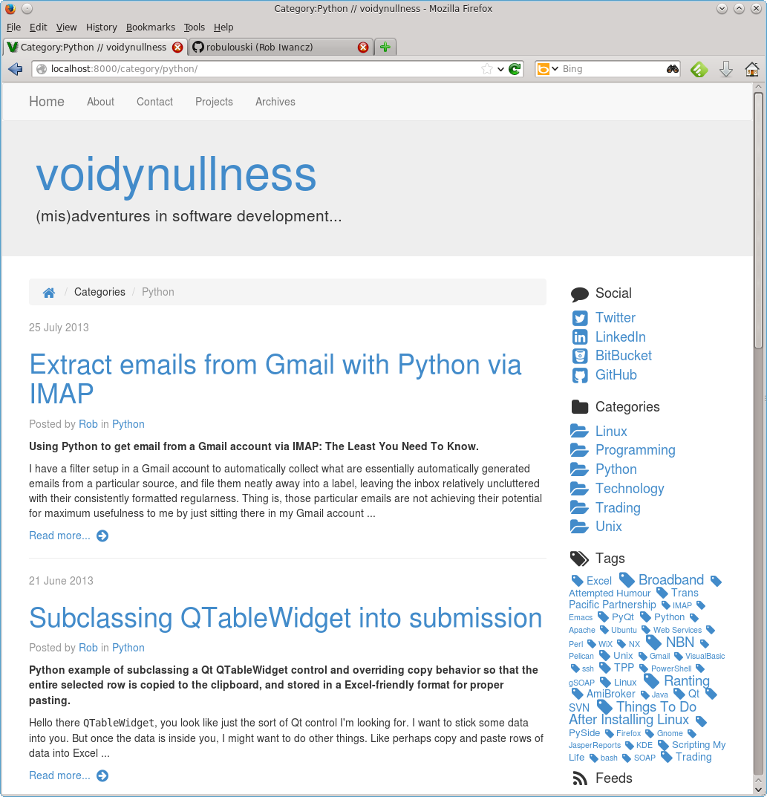

VoidyBootstrap
==============

*Version 2.1*

A `Bootstrap 3 <http://getbootstrap.com>`_ blog theme for the
`Pelican <http://getpelican.com>`_ static site generator.

VoidyBootstrap is a Pelican theme that aims to be mobile friendly,
responsive, flexible and easily customisable.  It can be used in single
column mode, or responsive 2 column mode with sidebar.

While the theme provides lots of customisation options, care has been taken
to make it usable right out of the box with minimal configuration and
sensible defaults -- albeit with the ubiquitous Bootstrap look and feel.
But that's kind of the idea with this theme -- start with bog standard
Bootstrap, then customise as much or as little as you like.

On larger screens, with the sidebar enabled, you get a clean and
responsive 2 column layout.  At the top there's a navbar containing page
links, and jumbotron area.  The default sidebar has category links and optional
tag-cloud.  `Font Awesome 4 <http://fontawesome.io/>`_ is used for icons.

VoidyBootstrap is functional but deliberately minimal in terms of design.
It can be used as is, if your design need are modest and all you want is
basic theme that "just works", with all the common features you'd expect
from a blog theme.  But for those who do want to tinker and customise, it
can be used as a starting point for creating custom Bootstrap-based
websites.  This theme has many features designed to facilitate creating a
custom design on top of the default Bootstrap base it provides.  Regardless
of whether you use few or many of the customisation features provided, what
you get is a carefully crafted Pelican theme that tries to accommodate
common blogging needs and provide ways to easily accomplish common
customisations.  It strives to be as minimal, flexible and unopinionated as
possible, while still being as usable and simple as possible.

Customised CSS, JavaScript and other modifications can be easily
incorporated using configuration settings, and content can be added to the
base layout (without modifying existing templates) by strategically adding
template fragments.

Installation
------------

Clone this repo, then in your ``pelicanconf.py`` set the ``THEME`` variable
to point to it::

  THEME = 'path/to/voidy-bootstrap/'

Out of the box what you get is the stock standard Bootstrap 3 look and
feel.  To customise things see below.

Example Settings
----------------

All of these are optional, but here is a basic example of common settings
you might want to configure.

The following should be set in ``pelicanconf.py``::

  SITESUBTITLE ='Sub-title that goes underneath site name in jumbotron.'
  SITETAG = "Text that's displayed in the title on the home page."

  # Extra stylesheets, for bootstrap overrides or additional styling.
  STYLESHEET_FILES = ("pygment.css", "voidybootstrap.css",)

  # Put taglist at end of articles, and use the default sharing button implementation.
  CUSTOM_ARTICLE_FOOTERS = ("taglist.html", "sharing.html", )
  CUSTOM_SCRIPTS_ARTICLE = "sharing_scripts.html"

  # Default sidebar template. Omit this setting for single column mode without sidebar.
  SIDEBAR = "sidebar.html"

  SOCIAL = (('Google+', 'http://plus.google.com/userid',
           'fa fa-google-plus-square fa-fw fa-lg'),
          ('Twitter', 'https://twitter.com/username', 
           'fa fa-twitter-square fa-fw fa-lg'),
          ('LinkedIn', 'http://linkedin-url', 
           'fa fa-linkedin-square fa-fw fa-lg'),
          ('BitBucket', 'http://bitbucket.org/username', 
           'fa fa-bitbucket-square fa-fw fa-lg'),
          ('GitHub', 'http://github.com/username',
           'fa fa-github-square fa-fw fa-lg'),
          )

The following are probably better suited for ``publishconf.py``::

  FEED_DOMAIN = SITEURL
  FEED_ALL_ATOM = 'feeds/all.atom.xml'

  DISQUS_SITENAME = "disqussitename"
  GOOGLE_ANALYTICS = "UA-xxxxxxxxxx"
  GOOGLE_ANALYTICS_SITEID = "gasiteid"
  TWITTER_USERNAME = "twitterusername"

Basic Configuration and Customisation
-------------------------------------

By default all required CSS and JavaScript files are downloaded from CDNs.
Intentionally little is supplied in the theme's ``static/css``.  Just a
``pygment.css`` file, and a sample css file (``voidybootstrap.css``) with
very minimal styling is provided as a starting point.

The simplest way to customise things is to override the standard Bootstrap
styles as necessary.  The theme intentionally avoids loading any additional
stylesheets by default, but this can easily be done by using the
``STYLESHEET_FILES`` setting.  ``STYLESHEET_FILES`` is a list for specifying
additional stylesheets that will be loaded by the ``base.html`` template
after the main Bootstrap CSS file.  Place any CSS stylesheet files you may
require in the ``static/css`` directory and add the filenames to the
``STYLESHEET_FILES`` setting in ``pelicanconf.py``

For example, if you've placed your own CSS styling in a stylesheet called
``custom.css`` (possibly using ``voidybootstrap.css`` as a starting point),
then you would need something like this in your ``pelicanconf.py``::

  STYLESHEET_FILES = ("pygment.css", "custom.css",)

Custom Bootstrap
----------------

As an alternative, or in addition, you can easily replace the standard
Bootstrap file with a customised one.  The ``BOOTSTRAP_STYLESHEET`` setting
is provided for this.  The default behaviour -- if this variable is *not*
set -- is that a standard ``bootstrap.min.css`` will be used from a CDN.

To use a different (i.e. customised) Bootstrap stylesheet, set
``BOOTSTRAP_STYLESHEET`` to the filename of a stylesheet to use instead.

This could be a customised Bootstrap stylesheet compiled manually from the
Bootstrap source files, or perhaps one obtained from an online source.

For example, you could use the `Bootstrap customizer
<http://getbootstrap.com/customize/>`_ to create your own customised
Bootstrap CSS file.  Place that file in ``static/css`` and set
``BOOTSTRAP_STYLESHEET`` to its filename.

Similarly, a `Bootswatch <http://bootswatch.com/>`_ theme can be easily
integrated.  Select a theme and download the files.  Place all the
necessary CSS files in ``static/css``.  Set ``BOOTSTRAP_STYLESHEET`` to
the filename of the main Bootstrap CSS file, and specify any additional CSS
files in the ``STYLESHEET_FILES`` list.

Further Customisation
---------------------

Like any other Pelican theme, you can just take the templates provided
and modify them to your liking.  However, if you're happy with the overall
layout and just want to add/subtract things here are there, this theme
provides "hooks" to do just that by setting specific
variables in your ``pelicanconf.py`` and/or providing your own template
fragments.  For simple customisations, this can make is relatively
straightforward to isolate modifications and easily keep up to date with
any upstream changes.

These customisation "hooks" are settings that can be configured in
``pelicanconf.py`` to point to filenames of custom template fragments.
These template fragments will either add or replace content in the default
layout provided by the theme.  For example, if ``pelicanconf.py`` contains
the line::

  CUSTOM_FOOTER = "custom/footer.html"

Then the bottom of every page will contain whatever is in the template
file located at::

  templates/includes/custom/footer.html

See the "Custom Includes" section below for further details.

Note that these template fragments must be relative to the theme's
``templates/includes/`` directory.

Standard Settings
-----------------

VoidyBootstrap honors the following `standard Pelican settings
<http://docs.getpelican.com/en/latest/settings.html>`_:

* ``SITEURL``
* ``SITENAME``
* ``SITESUBTITLE``
* ``LINKS``
* ``SOCIAL``
* ``TWITTER_USERNAME``
* ``FEED_DOMAIN``
* ``FEED_ALL_ATOM``
* ``FEED_ALL_RSS`` 
* ``DISQUS_SITENAME``
* ``GOOGLE_ANALYTICS``

For the most part they should work as expected, although some may behave
slightly differently than in the default Pelican theme (see next section).

Settings
--------

This theme supports the following configuration settings.  All are
optional.  

``SITESUBTITLE``
  Sub-title -- displayed in jumbotron.

``SITETAG``
  Text that will be placed in the title on the home page.

``DEFAULT_METADESC``
  Default value for HTML meta description tag.  Individual articles and
  pages can specify their own meta description by using the theme's custom
  ``description`` metadata tag.

``BOOTSTRAP_STYLESHEET``
  Bootstrap CSS file to use instead of default, as described above.

``STYLESHEET_URLS``
  A list of URLS for additional stylesheets that should be pulled in by
  the ``base.html`` template, like CSS files from a CDN.  Useful for adding
  the bootstrap theme CSS, for example.

``STYLESHEET_FILES``
  An list of filenames (relative to the ``/theme/css/`` directory) for
  additional stylesheets that should be pulled in by the ``base.html``
  template (after any STYLESHEET_URLS entries).

``SKIP_DEFAULT_CSS`` 
  No default CSS files at all will be used if this is set to True.  In this
  case the only stylesheets used will be those specified in
  ``STYLESHEET_FILES`` and ``STYLESHEET_URLS``.  This setting is provided
  to give more control over which specific Bootstrap (and Font Awesome) CSS
  files are used (i.e. it allows a specific version to be configured
  through settings).  But it means for things to work properly at a minimum
  the Bootstrap and Font Awesome need to be configured using the
  STYLESHEET_* settings.

``SKIP_DEFAULT_JS``
  Don't load any default JavaScript in the base template.  If this is set
  to True, at a minimum jQuery and the Bootstrap JavaScript must be
  provided via ``JAVASCRIPT_FILES`` and/or ``JAVASCRIPT_URLS``.

``SKIP_DEFAULT_NAVIGATION``
  Don't display navbar at the top of the page.  (If required a custom navigation
  template can be configured via ``CUSTOM_SITE_HEADERS``.)

``JAVASCRIPT_FILES`` and ``JAVASCRIPT_URLS`` 
  Similar to the STYLESHEET_* settings, these allow arbitrary JavaScript
  files to be loaded.  They will be referenced at the bottom of
  ``base.html``, after any default script files.

``ARCHIVES_URL``
  URL of archives page.  Default is ``archives.html``.  If you're modifying
  ``ARCHIVES_SAVE_AS`` in your pelicanconf.py then you'll probably need to
  change this setting as well.

``TWITTER_USERNAME``
  Set to a valid Twitter username to enable the twitter sharing button.

``TWITTER_CARD``
  If set to True, Twitter Card meta-data will be added to article pages.
  If this is enabled, ``TWITTER_USERNAME`` must also be set.

``OPEN_GRAPH``
  Set to True to enable Facebook Open Graph meta-properties.

``OPEN_GRAPH_FB_APP_ID``
  Facebook App ID.

``OPEN_GRAPH_ARTICLE_AUTHOR``
  Value for Open Graph ``article:author`` property, which will be set on
  article pages.

``OPEN_GRAPH_IMAGE``
  Default value for Open Graph ``og:image`` property on index pages.

``DEFAULT_SOCIAL_IMAGE``
  Default value for Open Graph ``og:image`` property (and Twitter card
  image, if enabled) on articles and pages.  The custom ``social_image``
  metadata tag can be used to specify a per-article (or per-page) value,
  which will always take precedence

``FAVICON``
  Allows an alternative favicon filename to be specified.

Sidebar Settings
----------------

As of version 2.0 of VoidyBootstrap, the sidebar is optional.  To enable
the default sidebar, add the following line to your ``pelicanconf.py``::

  SIDEBAR = "sidebar.html"

This will give you a simple sidebar with social media links and a list of
Categories, which can be customised using the options described in this
section.

Optionally, if you'd like to use the LINKS setting or include a list of tags
in the default sidebar, add the following to ``pelicanconf.py`` after
``SIDEBAR``::

  CUSTOM_SIDEBAR_MIDDLES = ("sb_links.html", "sb_taglist.html", )

As of Pelican 3.6 `tag cloud support has been removed from Pelican 
<https://github.com/getpelican/pelican/commit/9dd4080fe6162849aec0946cc8406b04da764157>`_, 
so if you'd like a proper tag cloud in the sidebar you'll need to configure
the `tag_cloud plugin
<https://github.com/getpelican/pelican-plugins/tree/master/tag_cloud>`_
and add the following to ``pelicanconf.py``::

  CUSTOM_SIDEBAR_MIDDLES = ("sb_tagcloud.html", )

The "sidebar" is an area where many sites will require something specific
and it's unlikely any particular implementation will satisfy everyone all
the time.  However, there are things that commonly appear in sidebars
(e.g. author bio, categories, tag cloud, etc), so the theme includes a
default sidebar template that provides a fairly typical sidebar
implementation.  The default sidebar has a few customisation settings so
that common things can be added and configured via settings in
``pelicanconf.py`` (as described in this section), but it's intended more
as a starting point for custom implementations rather than an attempt to
satisfy all possible use cases.

For those who might want something completely different in a sidebar, just
create your own sidebar template (possibly using ``includes/sidebar.html``
as a starting point), and then set ``SIDEBAR`` to point to it. This will
completely replace the theme's default sidebar with whatever is in your
custom sidebar template.

But for those happy enough to stick with the default sidebar, the following
settings are available to customise it:

``SOCIAL``
  Social media links to display in sidebar.  This option is handled a bit
  differently than in the default Pelican theme.  This should be a list/tuple where
  each element is a tuple with 3 elements: (name, URL, Font Awesome icon
  class).  (See the "Example Settings" section above for an example.)  The
  last element (icon class) can be omitted, in which case a generic icon
  will be used instead.

``LINKS``
  Optional list of arbitrary links to display in the sidebar.  Each element
  must be a tuple with 2 elements: (link title, URL).  For this option to
  work with the default sidebar, "sb_links.html" needs to be added to 
  ``CUSTOM_SIDEBAR_MIDDLES`` (as shown above).

``SIDEBAR_HIDE_CATEGORIES`` 
  A list of categories is displayed in the sidebar by default.  Set this
  option to True to disable this category list.

``SIDEBAR_SIZE``
  The number of columns in the Bootstrap grid the sidebar should take up.
  The default is 3.

See also ``CUSTOM_SIDEBAR_TOP``, ``CUSTOM_SIDEBAR_BOTTOM`` and
``CUSTOM_SIDEBAR_MIDDLES`` below.

Custom Includes
---------------

The following settings (all optional), if specified, should be set to
filenames of appropriate template fragments that will be included at
strategic points from the primary templates.  They will override or add to
existing sections of content.  All filename paths must be relative to the
theme's ``templates/includes`` directory.

Note that in the following setting names, an "*" (asterisk) represents a
page type, possible values of which are: INDEX, ARTICLE, PAGE, CATEGORY,
TAG, AUTHOR, ARCHIVES.

(Also note that in Version 2.0 of this theme, many settings were renamed,
and many new ones added.  See CHANGES.rst.)

``CUSTOM_SITE_HEADERS``
  List of templates that will replace the default site header area (i.e. the
  jumbotron area).

``CUSTOM_HEADER_*``
  Add custom content after the site headers, before the main container, and
  outside any container dev (and therefore before any content columns).

``CUSTOM_CONTAINER_TOP_*``
  Similar to CUSTOM_HEADER_*, but inside the main container div.  Not
  inside any row or column, so any content here will span across the top of
  both columns (in 2 column mode).

``CUSTOM_CONTENT_TOP_*``
  Template fragment that will be inserted at the top of the content column, 
  before anything else.

``CUSTOM_CONTENT_BOTTOM_*``
  These will be included right at the bottom of the content column.

``CUSTOM_CONTAINER_BOTTOM_*``
  These will be included at the bottom of the main container, after the
  columns.  Content will end up inside a container but outside of columns,
  spanning across the bottom, below both columns (in 2 column mode).

``CUSTOM_ARTICLE_HEADERS``
  List of templates that will replace the default article header
  provided in ``includes/article_header.html`` on *article pages only*.

``CUSTOM_INDEX_ARTICLE_HEADERS``
  List of templates that will replace the default article
  header provided in ``includes/article_header.html`` on *index pages only*.

``CUSTOM_ARTICLE_PRECONTENT``
  Template fragment that will be inserted just before the start of the
  article body text (after any headers, image and standfirst).

``CUSTOM_ARTICLE_FOOTERS`` and ``CUSTOM_PAGE_FOOTERS``
  List of templates that will included at the bottom of articles/pages,
  after the body text but before the comments.  Can be used to configure
  any appropriate content, like sharing buttons, taglist, etc.

``CUSTOM_FOOTER``
  Footer template to be included by ``base.html``.  Anything here
  (e.g. copyright text) will appear between footer tags at the bottom of
  every page.

``CUSTOM_SCRIPTS_ARTICLE`` and ``CUSTOM_SCRIPTS_PAGE`` and ``CUSTOM_SCRIPTS_ARCHIVE``
  Template fragment for any additional javascript code specific to articles,
  pages and archives respectively (useful for things like social media sharing
  code).  Will be included at the bottom of pages, just before the
  closing body tag.  Set to ``includes/sharing_scripts.html`` to use the
  default provided implementation.

``CUSTOM_SCRIPTS_BASE``
  As above, but will be included on every page.

``CUSTOM_SIDEBAR_TOP``
  Included by ``sidebar.html`` at the top of the sidebar.  Provides a
  convenient place for an "about" blurb, for example.

``CUSTOM_SIDEBAR_BOTTOM``
  Included by ``sidebar.html`` at the bottom of the sidebar.

``CUSTOM_SIDEBAR_MIDDLES``
  List of templates that will be included by ``sidebar.html`` after
  Categories but before ``CUSTOM_SIDEBAR_BOTTOM``.  Provided mainly as an
  easy way to use the default tag cloud implementation.  Realistically, if
  you're doing more customisations than this in your sidebar, a better
  option is just to create your own implementation of ``sidebar.html`` and
  use this instead (as described in "Sidebar Settings").

``CUSTOM_INDEX_META``
  Included by ``index.html`` in the ``head`` section.  Can be used
  to add extra HTML meta tags to index pages, for example.

``CUSTOM_HTML_HEAD``
  Included by ``base.html`` in the ``head`` section.

Custom Metadata Tags
--------------------

This theme supports the following (optional) custom metadata tags for use
in articles and pages.

``description``
  Can be used in pages and articles to provide a value for the HTML meta
  description tag, and social meta data (i.e. Open Graph).

``standfirst``
  Text for a summary/intro paragraph that will be placed at the start of an
  article.  This paragraph will be given a CSS class of "standfirst" so
  that additional styles can be applied.

``social_image``
  Set to an image filename (relative to ``{{ SITEURL }}/images/``) to 
  provide a value for an article's ``og:image`` meta property.

``image``
  Set to an image filename (relative to ``{{ SITEURL }}/images/``) to
  display a (responsive) "featured image" at the top of an article,
  underneath any standfirst.

``schema_type``
  Pages only.  A schema.org itemtype for the page.  Default is "WebPage".

``javascript``
  Pages only.  Filename of a JavaScript file (relative to ``theme/js/``
  directory) to load for this page.

Security Considerations
-----------------------

By default, this theme obtains various dependency files (styles, scripts,
etc) from CDNs.  In an attempt to follow current security best practices,
files linked from CDNs are retrieved via HTTPS, and use
`integrity attributes. <https://en.wikipedia.org/wiki/Subresource_Integrity>`_

In addition, if your server has a `Content-Security-Policy (CSP)
<https://en.wikipedia.org/wiki/Content_Security_Policy>`_ header
configured, it should take into account the CDNs used by the theme.

For example, a policy in Nginx configuration syntax that covers the external
resources used by this theme might look something like::

  add_header Content-Security-Policy "default-src 'none' ; img-src 'self' ; font-src 'self' https://maxcdn.bootstrapcdn.com ; form-action 'self' ; frame-ancestors 'none' ; media-src 'self' ; script-src 'self' https://ajax.googleapis.com https://maxcdn.bootstrapcdn.com https://oss.maxcdn.com ; style-src 'self' https://maxcdn.bootstrapcdn.com " ;

Author
------

| Robert Iwancz
| www.voidynullness.net
| `@robulouski <https://twitter.com/robulouski>`_

Screenshot
----------

License
-------

Licensed under the `MIT License <http://opensource.org/licenses/MIT>`_

